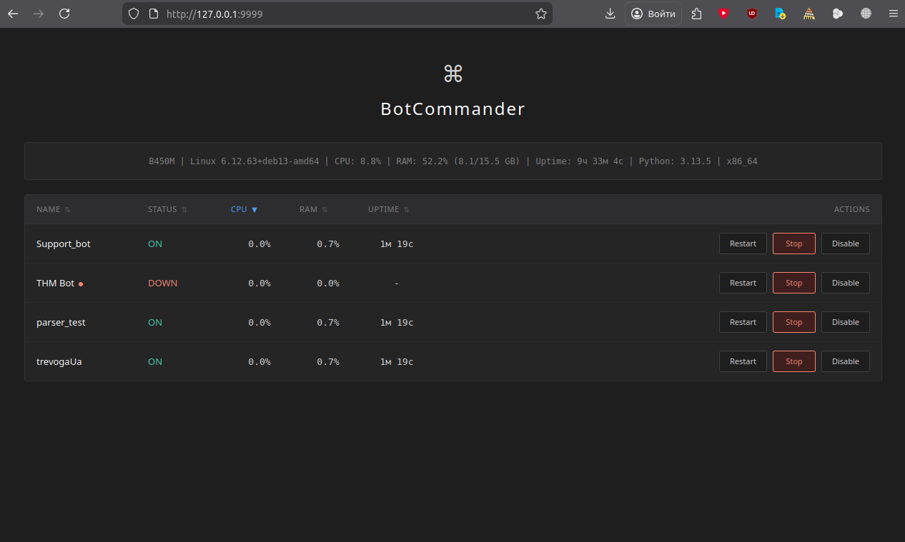

<h1 align="center"><b>⌘ BotCommander</b></h1> 

 

BotCommander is a simple and user-friendly web interface for managing multiple Python bots. Each bot is isolated in its own directory with a virtual environment (venv). The interface displays status, CPU/RAM usage, uptime, and allows you to start, stop, restart, and disable bots.

🛠 Features

    Web interface built on Flask
    Automatic startup of all bots on launch
    Monitor CPU, memory, and uptime for each bot
    Bot management: start, stop, restart, disable
    Display system information (CPU, RAM, uptime, OS, etc.)

BotCommander doesn't use Docker because Python's virtual environments (venv) provide sufficient isolation for managing bots — it's lighter, faster, and doesn't waste resources on container overhead.

☑ Running BotCommander

    #Install dependencies:
    pip install flask psutil

    #Launch the interface:
    python3 main.py

    Open in your browser: http://localhost:9999

⬡ Adding a New Bot

    #Create bot directory
    mkdir -p bot/mybot
    cd bot/mybot
    
    
    #Create virtual environment
    python3 -m venv venv
    source venv/bin/activate

    #Install dependencies
    pip install <required_dependencies>

    #Create bot entry point
    nano main.py

△ Important: Each bot must have a main.py file and a venv/ virtual environment.
   Bots are launched with: source venv/bin/activate && python3 main.py

