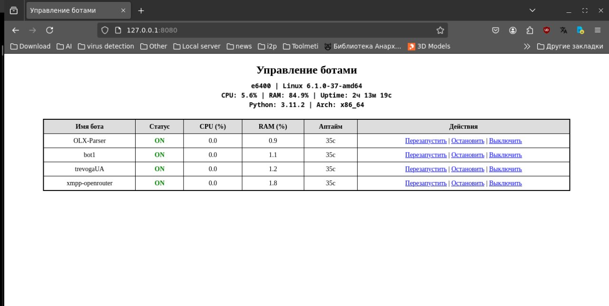

 

🚀 BotCommander

BotCommander — это простой и удобный веб-интерфейс для управления множеством Python-ботов.
Каждый бот изолирован в своей собственной директории с виртуальным окружением (venv). Интерфейс показывает статус, загрузку CPU/RAM, аптайм, а также позволяет запускать, останавливать, перезапускать и отключать ботов.
🛠 Возможности

    Веб-интерфейс на Flask

    Автоматический запуск всех ботов при старте

    Мониторинг загрузки CPU, памяти и аптайма каждого бота

    Управление ботами: запуск, остановка, перезапуск, отключение

    Отображение системной информации (CPU, RAM, аптайм, ОС и т.д.)
    
📦 BotCommander
├── main.py # Основной скрипт с Flask-интерфейсом
└── bot/
├── bot1/
│ ├── venv/ # Виртуальное окружение для бота
│ └── main.py # Обязательный скрипт запуска бота
└── bot2/
├── venv/
└── main.py

    ⚠️ Важно: у каждого бота обязательно должен быть файл main.py, а также создано виртуальное окружение venv/.
    Скрипт запускает бота с помощью source venv/bin/activate && python3 main.py.

🧩 Пример добавления нового бота

mkdir -p bot/mybot
cd bot/mybot
python3 -m venv venv
source venv/bin/activate
pip install <нужные_зависимости>
nano main.py  # создайте и напишите код вашего бота

✅ Запуск BotCommander

Установите зависимости:

pip install flask psutil

Запустите интерфейс:

python3 main.py

Откройте в браузере: http://localhost:9999
